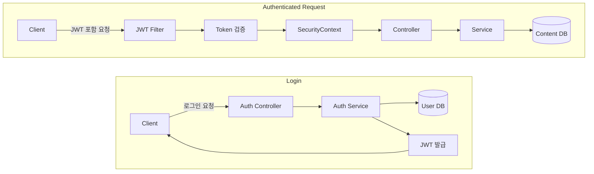

# CMS 콘텐츠 관리 REST API (Spring Boot, JWT)

Spring Boot 기반으로 콘텐츠 CRUD와 JWT 인증/인가를 구현한 API입니다.
단순 기능 구현에 그치지 않고 조회수 처리 방식, 페이징 전략, N+1 문제 등을 고려하여 실제 서비스 환경을 가정하고 설계했습니다.


## 1. 실행 방법

**1. 애플리케이션 실행**
``` bash
./gradlew bootRun
```

**2. H2 Console**
```bash
http://localhost:8080/h2-console
```
**JDBC URL**: jdbc:h2:mem:test

**username**: sa

**password**:

(제공해준 yml로 구성하였습니다.)


## 2. 로그인 방식

JWT 기반 인증 방식을 사용했습니다.

로그인 시 사용자 정보를 검증한 뒤 Access Token을 발급하며

이후 요청에서는 Authorization 헤더에 Bearer 토큰을 포함하여 인증을 처리합니다.

Spring Security Filter에서 토큰을 검증하고 인증된 사용자 정보를 SecurityContext에 저장하도록 구성했습니다.

## 3. 인증 흐름



## 4. 권한 정책

| 역할 | 권한 |
| :--- | :--- |
| USER | 콘텐츠 생성, 본인 콘텐츠 수정/삭제 |
| ADMIN | 모든 콘텐츠 수정/삭제, 콘텐츠 잠금/해제 |


## 5. 구현 기능

**1. 콘텐츠 CRUD**

- 콘텐츠 생성
  
- 콘텐츠 목록 조회
  
- 콘텐츠 상세 조회
  
- 콘텐츠 수정
  
- 콘텐츠 삭제

**2. 로그인 기능**

- Spring Security + JWT 기반 로그인
  
- 로그인 성공 시 Access Token 발급

**3. 접근 권한 제어**

- 작성자 본인만 수정/삭제 가능
  
- ADMIN은 모든 콘텐츠 수정/삭제 가능

**4. 추가 기능: ADMIN 콘텐츠 잠금/해제**

과제 필수 요구사항 외에 운영 관점의 확장 기능으로 관리자 전용 잠금/해제 기능을 추가했습니다.

- ADMIN은 특정 콘텐츠를 잠글 수 있음
  
- 잠긴 콘텐츠는 일반 사용자가 수정할 수 없음
  
- 공지성 게시물 검토 완료 게시물 보호 시나리오를 고려
  

## 6. 페이징 처리
목록 조회는 단순 Offset 기반이 아닌 Seek Pagination으로 구현했습니다.

**적용 이유**
- Offset 기반 페이지네이션은 뒤 페이지로 갈수록 불필요한 데이터 스캔 비용이 증가합니다.
- 이를 줄이기 위해 createdDate, id를 복합 커서로 사용하여 다음 페이지를 조회하도록 구현했습니다.

**조회 방식**
``` SQL
WHERE (created_date < lastCreatedDate) OR (created_date = lastCreatedDate AND id < lastId)
ORDER BY created_date DESC, id DESC
```

**장점**
- 뒤 페이지로 갈수록 성능 저하가 커지는 문제 완화
- 일정한 조회 성능 유지에 유리
- 무한 스크롤 구조에 적합

## 7. 성능 개선 포인트

**1. Seek Pagination 적용**
- Offset 스캔 비용을 줄이기 위해 커서 기반 조회 적용

**2. N+1 문제 해결**
- 콘텐츠 목록 조회 시 작성자 정보를 함께 조회하는 과정에서 발생할 수 있는 N+1 문제를 방지하기 위해 fetch join을 적용했습니다.

**3. 조회수 증가 로직 개선**
- 기존 엔티티 필드 증가 방식 대신 JPQL update 쿼리를 사용해 DB 레벨에서 조회수를 증가시키도록 개선했습니다.
- 이 방식으로:
    - 동시성 환경에서도 정확한 값 반영 가능
    - 단순 viewCount++ 방식의 경쟁 조건 완화

## 8. 성능 테스트

k6를 사용해 목록 조회 API의 부하 테스트를 수행했습니다.

**테스트 목적**
- 기본 목록 조회 성능 확인
- Offset 대비 Seek Pagination 적용 효과 확인
- 커서 기반 다음 페이지 조회 흐름 검증

**테스트 결과**
- Offset vs Seek 비교

| 항목 | Offset | Seek |
| :--- | :--- | :--- |
| avg | 7.92ms | 6.39ms |
| p95 | 22.85ms | 21.13ms |
| 실패율 | 0% | 0% |

- 커서 기반 연속 조회 검증
    - avg: 1.20ms
    - p95: 2.62ms
    - 실패율: 0%

Seek Pagination 적용 후 응답 시간이 소폭 개선되었고 커서 기반 다음 페이지 조회도 안정적으로 동작함을 확인했습니다.

## 9. 테스트 코드

핵심 로직 검증을 위해 통합 테스트를 작성했습니다.

**AuthIntegrationTest**
- 회원가입 성공
- 중복 username 회원가입 실패
- 로그인 성공
- 로그인 실패
- JWT 없이 보호 API 접근 실패
- JWT 포함 시 보호 API 접근 성공

**ContentIntegrationTest**
- 콘텐츠 등록 성공
- 작성자가 아닌 사용자의 수정/삭제 실패
- ADMIN의 타 사용자 콘텐츠 수정/삭제 성공
- 상세 조회 시 조회수 증가
- 커서 기반 목록 조회 성공
- 다음 커서로 연속 조회 가능 여부 검증

**테스트 실행**
```
./gradlew clean test
```

실행 결과:
`BUILD SUCCESSFUL`

## 10 . API 문서

Swagger(OpenAPI)를 적용했습니다.

**접속 경로**
```bash
http://localhost:8080/swagger-ui/index.html
```

### JWT 사용 방법

1. `/api/auth/login` 호출
2. 발급받은 `access token` 확인
3. Swagger 우측 상단 **Authorize** 클릭
4. 아래 형식으로 입력
``` bash
   Bearer {accessToken}
```

## 11. 사용한 AI 도구 및 참고 자료

* ChatGPT

  * 인증 흐름 및 설계 방향 검토
  * 성능 개선 관련 아이디어 참고
  * README 구성 및 표현 정리

* 공식 문서 및 레퍼런스

  * Spring Security
  * Spring Data JPA
  * H2 Database
  * springdoc-openapi
  * k6

※ AI는 설계 검토 및 아이디어 참고 수준으로 활용했으며 최종 설계 및 구현, 테스트는 직접 수행했습니다.
