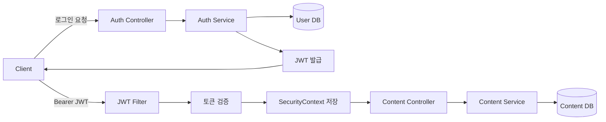

## 인증 흐름

```mermaid
flowchart LR
    A[Client] -->|로그인 요청| B[Auth Controller]
    B --> C[Auth Service]
    C --> D[(User DB)]
    C --> E[JWT 발급]
    E --> A

    A -->|Bearer JWT| F[JWT Filter]
    F --> G[토큰 검증]
    G --> H[SecurityContext 저장]
    H --> I[Content Controller]
    I --> J[Content Service]
    J --> K[(Content DB)]
```